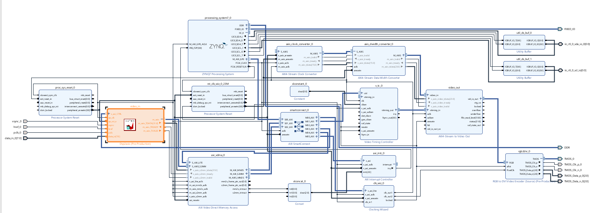

# OV7670 Camera on PYNQ-Z2 → HDMI Demo

## Table of Contents

1. [Project Overview](#project-overview)  
2. [Repository Structure](#repository-structure)  
3. [Hardware Requirements](#hardware-requirements)  
4. [Vivado Block Diagram](#vivado-block-diagram)  
5. [Clocking & Reset](#clocking--reset)  
6. [HLS IP: dvp2axis](#hls-ip-dvp2axis)  
7. [PS-EMIO I²C (SCCB) Setup](#ps-emio-i²c-sccb-setup)  
8. [AXI-Stream → Video Out Pipeline](#axi-stream--video-out-pipeline)  
9. [AXI-VDMA Configuration](#axi-vdma-configuration)  
10. [Top-Level Wrapper & XDC Constraints](#top-level-wrapper--xdc-constraints)  
11. [PYNQ Python Software](#pynq-python-software)   
12. [Known Issues & Tips](#known-issues--tips)  


---

## Project Overview

This project demonstrates a complete FPGA-and-software flow for:

1. **Capturing** live video from an OV7670 camera module via PMOD on a PYNQ-Z2 board  
2. **Programming** the camera’s SCCB registers over PS-EMIO I²C in Python  
3. **Packing** raw DVP data into AXI-Stream with a custom HLS IP (`dvp2axis`)  
4. **Buffering** frames in DDR using AXI-VDMA  
5. **Outputting** video over HDMI with Xilinx Video-Out IP  
6. **Controlling** and **viewing** all stages from a Python Jupyter notebook  

---

## Repository Structure

---

## Hardware Requirements

- **Digilent PYNQ-Z2** development board (XC7Z020-1CLG400C)  
- **OV7670** camera module with SCCB interface  
- **2× 1×6 PMOD connector cables** (Camera → PYNQ PMOD B)  
- **HDMI cable & monitor** for video out  
- **Micro-SD card** with PYNQ 3.x image  

---

## Vivado Block Diagram




**Major IP Blocks**  
- **Clocking Wizard**: Generates 24 MHz (camera XCLK) and 25 MHz (HDMI pixel clock)  
- **Processing System (PS-7)**:  
  - 7-series Zynq PS, with **I2C0 EMIO** enabled for SCCB  
  - DDR and fixed-IO connections for PS subsystems  
- **Utility Buffer (×2)**:  
  - Configured as IOBUF for `SCL_O/I/T` and `SDA_O/I/T` to PMOD pins  
- **Vivado HLS IP (`dvp2axis_0`)**: C→AXI-Stream converter for camera DVP  
- **AXI Data-Width & Clock Converters**: Match pixel width (2 bytes) & domain (25 MHz)  
- **Video Timing Controller (`v_tc_0`)**: Generates HSYNC/VSYNC/DE for 640×480@60 Hz  
- **AXI4-Stream to Video Out (`v_axi4s_vid_out_0`)**: Packs AXIS into TMDS signals  
- **AXI-VDMA (`axi_vdma_0`)**: S2MM for snapshot, MM2S for live loop (optional)  

---

## 5) Clocking & Reset

| Clock Source         | Used For               | Frequency  |
|----------------------|------------------------|-----------:|
| `sys_clk_pin` (MIO)  | PS DDR, PS Peripherals | 125 MHz    |
| `clk_wiz_0_clk_out0` | OV7670 XCLK            | 24 MHz     |
| `clk_wiz_0_clk_out1` | N/A                    | (unused)   |
| `clk_wiz_0_clk_out2` | Video Timing/HDMI Out  | 25 MHz     |

- **Reset**: `proc_sys_reset_0/peripheral_aresetn` synchronized to 25 MHz  

---

## 6) HLS IP: `dvp2axis`

- **Source**: `hls/dvp2axis.cpp`, `dvp2axis.h`  
- **Function**:  
  1. On each rising PCLK, sample `data_in[7:0]`, `href`, `vsync`.  
  2. When `href` is high, pack pixel into 16-bit RGB565.  
  3. Assert `tuser` at start of frame, `tlast` at end of line.  
- **Interface**:  
  - AXI4-Stream Master: `m_axis_tdata[15:0]`, `tvalid`, `tready`, `tuser`, `tlast`  
  - Clock: PCLK domain for input → output clock converter  
- **Co-Simulation**: `tb_dvp2axis.cpp` provides dummy DVP input to verify functionality.  

---

## 7) PS-EMIO I²C (SCCB) Setup

1. In the Zynq PS block, **enable EMIO** for **I2C0**.  
2. Add two **Utility Buffer** IPs, set **C Buf Type = IOBUF**.  
3. Wire PS EMIO pins:

--- 


## 8) AXI-Stream → Video-Out Pipeline

1. **Data-Width Converter**  
   - Use `axis_dwidth_converter_0` to ensure each transfer is 16 bits (2 bytes/pixel for RGB565).  
   - Set **TDATA_NUM_BYTES = 2**.

2. **Clock Domain Converter**  
   - Insert `axis_clock_converter_0` to move the AXI-Stream from the camera’s PCLK domain into the 25 MHz pixel-clock domain.  

3. **Video Timing Controller** (`v_tc_0`)  
   - Configure in generator mode for **640×480 @ 60 Hz**.  
   - Connect:  
     ```text
     clk_in     ← clk_wiz_0_clk_out2 (25 MHz)
     reset      ← proc_sys_reset_0/peripheral_aresetn (synchronous to 25 MHz)
     ```
   - Expose outputs: `hsync_out`, `vsync_out`, `active_video_out`, `fid_out`.

4. **AXI-4-Stream to Video Out** (`v_axi4s_vid_out_0`)  
   - In the IP configuration, select “Timing Controller” and point to `v_tc_0`.  
   - Clock & reset:  
     ```text
     clk       ← clk_wiz_0_clk_out2
     reset     ← proc_sys_reset_0/peripheral_aresetn
     ```
   - AXI-Stream interface:  
     ```text
     S_AXIS_VIDEO_TDATA   ← from axis_clock_converter_0/TDATA[15:0]
     S_AXIS_VIDEO_TVALID  ← upstream TVALID
     S_AXIS_VIDEO_TREADY  → upstream TREADY
     S_AXIS_VIDEO_TUSER   ← start-of-frame indicator
     S_AXIS_VIDEO_TLAST   ← end-of-line indicator
     ```
   - Video signals:  
     ```text
     vid_hsync       ← v_tc_0/hsync_out
     vid_vsync       ← v_tc_0/vsync_out
     vid_active_video← v_tc_0/active_video_out
     fid_in          ← v_tc_0/fid_out
     ```
   - TMDS outputs (`TMDS_Clk_p/n`, `TMDS_Data_p/n[2:0]`) are auto-generated and must be connected to the top-level ports.

---

## 9) AXI-VDMA Configuration

- **Instance**: `axi_vdma_0`  
- **Read (“S2MM”) Channel**  
  - Used by Python to snapshot a single frame from DDR.  
  - Configure buffer size = **width × height × stride** (e.g. 640×480×2 = 614 400 bytes).  
  - API in Python:
    ```python
    rc = ol.axi_vdma_0.readchannel
    rc.stop()
    rc.start(frame_bytes)
    buf = rc.readframe()
    rc.stop()
    ```
- **Write (“MM2S”) Channel**  
  - Drives the HDMI-Out front-end for continuous live display (optional).  
  - Configure same frame size and loop mode if you want live streaming.  
- **Frame Dimensions**  
  ```text
  width   = 640
  height  = 480
  stride  = 2 bytes/pixel (RGB565)
  frame_bytes = width × height × stride

---

## 10) Top-Level Wrapper & XDC Constraints

- **Wrapper Updates**  
  Extended the auto-generated `design_1_wrapper.v` to add only the two bidirectional SCCB ports (`iic_rtl_0_scl_io` and `iic_rtl_0_sda_io`), leaving all existing PS, DDR and HDMI pins intact.

- **XDC Adjustments**  
  Adjusted the constraints file to map the camera’s PMOD DVP and SCCB inout nets to the correct board pins, and set IOSTANDARDs (`LVCMOS33` for camera/PMOD, `TMDS_33` for HDMI) for those signals.

---

## 11) PYNQ Python Software

- **Overlay Loading**  
  In a Jupyter notebook, load and download the `OV7670HW.xsa` overlay.

- **Camera Initialization**  
  Use raw I²C via `i2ctransfer -y 1 w1@0x21 reg r1@0x21` to reset and configure the OV7670’s registers at 7-bit address 0x21.

- **Frame Capture**  
  Call `ol.axi_vdma_0.readchannel.start(size)` / `.readframe()` to grab one RGB565 frame of size (width×height×2 bytes) from DDR.

- **Image Decoding & Display**  
  In Python, unpack the 16-bit RGB565 buffer into 24-bit RGB and show it with Matplotlib.

## 12) Known Issues & Tips

- **PS-EMIO I²C bus** appears as `/dev/i2c-1` on PYNQ-Z2, not `/dev/i2c-0`.  
- **OV7670 SCCB** isn’t fully SMBus-compliant; use `i2ctransfer` (raw write–read) or a proper I²C library.  
- **Pull-ups** on SCL/SDA are required—most OV7670 PMOD boards include them, but double-check your breakout.  
- **Pixel clock domain**: all video IP (VTC, AXIS→Video, VDMA) must share the exact 25 MHz clock and reset.  
- **Reset timing**: use the `proc_sys_reset` output that’s synchronous to the 25 MHz video clock.  
- **AXIS interface**: Data-Width and Clock Converters must match TDATA_NUM_BYTES and FREQ_HZ of upstream/downstream IP.  
